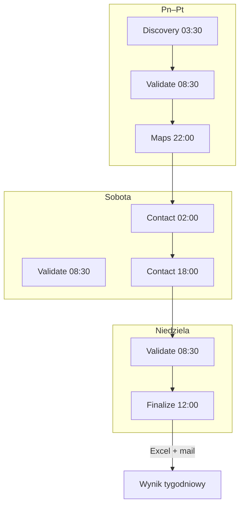

# Architektura pipeline'u

Dokument techniczny dla repozytorium **scraping-sklepow**. Opisuje segmentację, przepływ danych, pliki stanu i integrację z GitHub Actions.

---

## 1. Przegląd

Pipeline pobiera wpisy z neueroeffnung.info, wzbogaca je (Maps, kontakty, Claude), filtruje i eksportuje tygodniowy Excel z e-mailem.

**Produkcja:** 5 niezależnych workflow GHA, wspólny stan w `neueroeffnung_staging.json`.

**Development:** `PIPELINE_STAGE=full` — monolityczny run (jak przed segmentacją).

```
┌─────────────┐   ┌──────────┐   ┌──────┐   ┌─────────┐   ┌──────────┐
│  DISCOVERY  │──▶│ VALIDATE │──▶│ MAPS │──▶│ CONTACT │──▶│ FINALIZE │
│  HTTP scrape│   │ retry    │   │ Play │   │ Serper  │   │ Claude   │
└─────────────┘   └──────────┘   └──────┘   └─────────┘   │ Excel    │
       │                │             │            │         │ mail     │
       └────────────────┴─────────────┴────────────┴─────────┴──────────┘
                              neueroeffnung_staging.json
                         + cache (detail, maps, contact, processed)
```

---

## 2. Harmonogram GHA (czas polski, CEST UTC+2)

| Segment | Cron UTC | Cron PL | GHA timeout | `MAX_RUNTIME_SECONDS` |
|---------|----------|---------|-------------|------------------------|
| Discovery | `30 1 * * 1-5` | Pn–Pt 03:30 | 240 min | 14400 (4 h) |
| Validate | `30 6 * * *` | Codziennie 08:30 | 120 min | 7200 (2 h) |
| Maps | `0 20 * * 1-5` | Pn–Pt 22:00 | 240 min | 14400 |
| Contact | `0 0 * * 6`, `0 16 * * 6` | Sob 02:00, 18:00 | 240 min | 14400 |
| Finalize | `0 10 * * 0` | Nd 12:00 | 240 min | 14400 |

Po przejściu na CET (UTC+1) skoryguj crony w plikach `.github/workflows/pipeline-*.yml`.

### Jednorazowy kickoff: 2026-09-03

Wszystkie workflow segmentów używają reusable **`pipeline-gate.yml`**.  
Skrypt **`.github/scripts/pipeline_start_gate.sh`**:

- `PIPELINE_START_DATE=2026-09-03`
- **Przed tą datą:** scheduled cron → job `gate` ustawia `skip=true`, główny segment się **nie uruchamia** (success, notice w logu)
- **`workflow_dispatch`:** bramka zawsze `skip=false`
- **Od 2026-09-03:** crony działają normalnie (bramka przepuszcza)

Pierwszy automatyczny run: **Discovery 2026-09-03 03:30 PL** (czwartek).

### Tydzień roboczy

```
Pn–Pt 03:30   discovery
Pn–Pt 08:30   validate
Pn–Pt 22:00   maps          (MAPS_BATCH_LIMIT=200)
Sob 02:00     contact #1
Sob 08:30     validate
Sob 18:00     contact #2
Nd 08:30      validate
Nd 12:00      finalize      → Excel + mail
```

---

## 3. Moduły

| Moduł | Odpowiedzialność |
|-------|------------------|
| `neueroeffnung_scraper.py` | Scrape, walidacja, Excel, dispatch `PIPELINE_STAGE` |
| `pipeline_state.py` | Staging JSON, merge discovery, `RuntimeBudget`, `StageResult` |
| `google_maps_enricher.py` | Playwright, cache Maps |
| `contact_enrichment.py` | Serper batch, scrape, cache kontaktów |
| `claude_record_normalizer.py` | Filtr jakości, spójny `informacja`, weryfikacja kontaktów |
| `send_mail.py` | Gmail SMTP + kopia w Wysłane |

### Funkcje etapów (`neueroeffnung_scraper.py`)

| `PIPELINE_STAGE` | Funkcja |
|------------------|---------|
| `discovery` | `run_discovery_stage()` |
| `validate` | `run_validate_stage()` |
| `maps` | `run_maps_stage()` |
| `contact` | `run_contact_stage()` |
| `finalize` | `run_finalize_stage()` |
| `full` | `run_scraper_full()` |

Wejście: `python neueroeffnung_scraper.py` (czyta `PIPELINE_STAGE` ze środowiska).

---

## 4. Model rekordu

### Dataclass `Record`

Kluczowe pola oprócz danych biznesowych:

| Pole | Typ | Opis |
|------|-----|------|
| `pipeline_stage` | str | Etap w pipeline (`discovery` … `po_scrape_kontakt`) |
| `maps_zweryfikowany` | bool | Trafienie Google Maps |
| `godziny_pracy` | str | Z Maps — wyklucza Excel |
| `telefon`, `email`, `website`, `osoba_kontaktowa` | str | Kontakty |
| `kontakt_zweryfikowany` | bool | Claude potwierdził kontakt |
| `claude_zweryfikowany` | bool | Rekord przeszedł filtr Claude |
| `status_walidacji` | str | `OK` / `Needs review` |

### Etapy `pipeline_stage`

```
discovery → validated → po_maps → po_scrape_kontakt
                                    │
                                    ▼ (finalize)
                              Excel + processed.json
```

| Stage | Ustawiany przez |
|-------|-----------------|
| `discovery` | Discovery (nowe / odświeżone wpisy) |
| `validated` | Validate |
| `po_maps` | Maps (po przetworzeniu rekordu, niezależnie od `maps_zweryfikowany`) |
| `po_scrape_kontakt` | Contact (po scrape lub gdy kontakt nie jest potrzebny) |

Po Finalize rekordy trafiają do `neueroeffnung_processed.json` i są usuwane ze staging.

---

## 5. Pliki stanu

### `neueroeffnung_staging.json`

```json
{
  "updated_at": "2026-09-02T14:00:00",
  "stage": "po_maps",
  "time_limit_hit": false,
  "sheets": {
    "Markets": [ { "...Record...", "pipeline_stage": "validated" } ],
    "Restaurants": [],
    "Drugstores": [],
    "Shopping centers": []
  }
}
```

Merge w Discovery (`pipeline_state.merge_discovery_sheets`):

- nowe rekordy → `pipeline_stage=discovery`
- istniejące w zaawansowanym stage → **bez nadpisywania**
- wpisy w `processed` → pomijane

### Cache (persystowane między runami GHA)

| Plik | Segmenty | Zawartość |
|------|----------|-----------|
| `neueroeffnung_detail_cache.json` | Discovery, Validate | HTML stron szczegółów |
| `neueroeffnung_maps_cache.json` | Maps | Wyniki Google Maps |
| `neueroeffnung_contact_cache.json` | Contact | Zweryfikowane kontakty |
| `neueroeffnung_processed.json` | Finalize | Fingerprinty wyeksportowanych |

GHA używa `actions/cache@v4` z kluczem `pipeline-${{ github.ref_name }}-…`.

---

## 6. Segmenty — szczegóły

### 6.1 Discovery

1. Scrape 4 kategorii (`collect_category_records`)
2. Clean, filtr dat Q3 2026 – Q4 2028
3. Merge do staging (bez nadpisywania zaawansowanych)
4. Zapis staging

**Wejście cache:** `detail_cache`, `processed`  
**Wyjście:** staging ze stage `discovery`

### 6.2 Validate

1. Wczytaj staging
2. Dla rekordów `pipeline_stage=discovery`: walidacja + max 2 retry
3. Twardy filtr dat po retry
4. Ustaw `pipeline_stage=validated` (lub usuń spoza zakresu)

### 6.3 Maps

1. Rekordy `pipeline_stage=validated`, max `MAPS_BATCH_LIMIT`
2. Playwright per rekord; błąd pojedynczego rekordu → log + następny
3. Po rekordzie: `pipeline_stage=po_maps`
4. Zapis maps cache + staging

### 6.4 Contact

1. Rekordy `pipeline_stage=po_maps`
2. Bez braków kontaktów → od razu `po_scrape_kontakt`
3. Reszta: Serper → scrape, max `CONTACT_BATCH_LIMIT`
4. `po_scrape_kontakt` tylko dla **ukończonych** jobów (w raporcie batch)
5. Zapis contact cache + staging

### 6.5 Finalize

1. Rekordy `pipeline_stage=po_scrape_kontakt`
2. Claude batch: filtr, `informacja`, kontakty
3. Przy limicie czasu: zapis staging, **bez Excel/mail**, wznowienie nd.+
4. Filtr godzin pracy → Skipped
5. Excel 8 arkuszy, mail, `processed.json`, cleanup staging

---

## 7. Graceful shutdown (limit czasu)

Klasa `RuntimeBudget` (`pipeline_state.py`):

- `check(logger)` → `False` gdy czas minął, ustawia `time_limit_hit`
- **Bez wyjątku** — segment kończy się normalnie
- `run_scraper()` → exit 0, log: *„postęp zapisany, wznowienie przy następnym cronie”*

Każdy segment używa `try/finally` do zapisu staging.

| Segment | Zachowanie przy limicie |
|---------|------------------------|
| Discovery | Partial scrape → merge + save |
| Validate | Partial retry → save |
| Maps | Partial batch → save cache |
| Contact | Partial scrape → save; nieadvance nieukończonych |
| Finalize | Partial Claude → save staging; skip Excel/mail |

---

## 8. Filtry twarde

| Reguła | Efekt |
|--------|-------|
| Data poza Q3 2026 – Q4 2028 | Skipped (`Opening date outside…`) |
| Godziny pracy w rekordzie | Skipped przed Excel (`Contains working hours`) |
| Claude reject | Skipped (`Rejected by Claude record filter`) |
| Już w processed | Pominięcie w Discovery |
| Kontakt bez `verified=true` | Puste kolumny Phone/Email/Contact person |

---

## 9. GitHub Actions — workflow

### Wspólny wzorzec

1. `actions/checkout@v4`
2. `actions/cache@v4` — staging + odpowiednie cache
3. `setup-python` 3.13
4. `pip install -r requirements.txt` (+ Playwright tylko Maps/full)
5. `python neueroeffnung_scraper.py` z `PIPELINE_STAGE`
6. `upload-artifact` (always)

### Sekrety per workflow

| Workflow | Secrets |
|----------|---------|
| discovery, validate | — |
| maps | — (Playwright public) |
| contact | `SERPER_API_KEY` |
| finalize | `ANTHROPIC_API_KEY`, `GMAIL_USER`, `GMAIL_APP_PASSWORD` |
| run-scraper (full) | wszystkie powyższe |

### `run-scraper.yml`

- Tylko `workflow_dispatch`
- `PIPELINE_STAGE=full`, timeout 4320 min
- Uruchamia pytest przed scrape
- Do testów integracyjnych / awaryjnego pełnego runu

---

## 10. Zmienne środowiskowe

| Zmienna | Domyślnie | Używana w |
|---------|-----------|-----------|
| `PIPELINE_STAGE` | `full` | Wszystkie |
| `MAX_RUNTIME_SECONDS` | `14400` | Wszystkie segmenty |
| `MAPS_BATCH_LIMIT` | `200` | Maps |
| `CONTACT_BATCH_LIMIT` | `250` | Contact |
| `ENABLE_GOOGLE_MAPS_ENRICHMENT` | `true` | Maps, full |
| `GOOGLE_MAPS_HEADLESS` | `true` | Maps |
| `ENABLE_CONTACT_ENRICHMENT` | `true` | Contact, full |
| `ENABLE_CLAUDE_RECORD_NORMALIZE` | `true` | Finalize, full |
| `ANTHROPIC_API_KEY` | — | Finalize |
| `SERPER_API_KEY` | — | Contact |
| `CLAUDE_CONTACT_MODEL` | `claude-sonnet-4-6` | Claude |
| `CONTACT_CLAUDE_BATCH_SIZE` | `20` | Claude batch |
| `GMAIL_USER`, `GMAIL_APP_PASSWORD` | — | Finalize |
| `SEND_EMAIL` | `true` w GHA | Finalize |

---

## 11. Testy

```
tests/
├── unit/              # parsery, filtry, pipeline_state, enrichery
├── integration/       # mock HTTP, E2E full (PIPELINE_STAGE=full)
├── regression/        # golden files
└── fixtures/          # HTML, JSON
```

```powershell
python -m pytest tests/ -q    # 146 testów
```

Testy wyłączają Maps/Contact/Claude przez `monkeypatch.setenv` lub domyślne flagi w CI.

---

## 12. Diagram zależności tygodnia



---

## 13. Rozszerzanie

- **Nowy segment:** dodaj funkcję `run_*_stage`, wpis w `dispatch`, workflow YAML, rozszerz cache paths.
- **Zmiana harmonogramu:** edytuj `cron` w odpowiednim `pipeline-*.yml`.
- **Większy throughput Maps:** zwiększ liczbę dni lub `MAPS_BATCH_LIMIT` (przy zachowaniu `MAX_RUNTIME_SECONDS`).
- **Reset pipeline'u:** usuń `neueroeffnung_staging.json` i opcjonalnie cache; `processed.json` zachowaj, jeśli nie chcesz re-eksportu.
